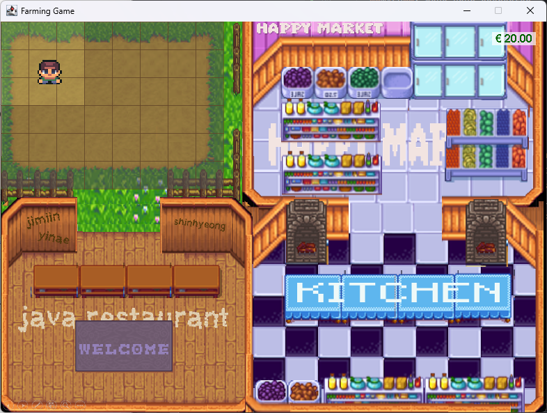
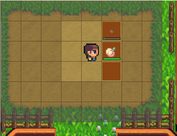
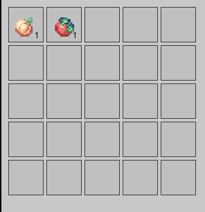
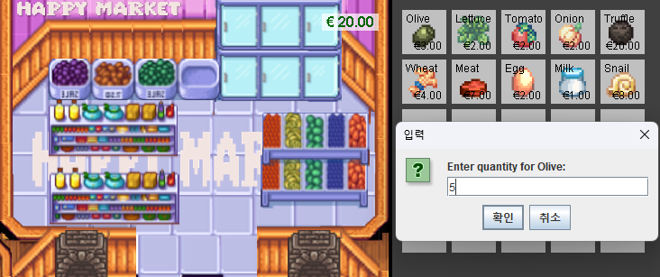
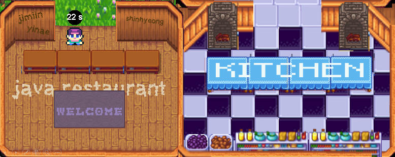
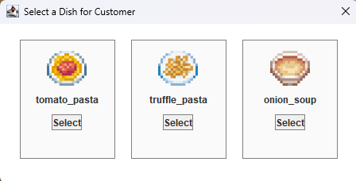
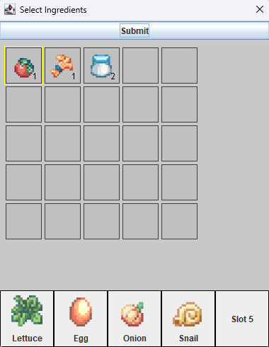

# JAVA Restaurant - IST-4-JAV Java Programming Assignment 
## Team Members
- Shinhyeong Lee / shinyeonglee@kaist.ac.kr
- Jimin Lee / leejm@postech.ac.kr
- Yinae Park / dlsoso1@unist.ac.kr


## How to Compile
### Environment & Stack
- **Operating System**: WSL Ubuntu 22.04.4 LTS
- java 17.0.12 2024-07-16 LTS

### Command
```
$ git clone https://github.com/YinaePark/jav_game.git
$ cd jav_game
$ sudo apt install openjdk-17-jdk
$ sudo apt-get install openjdk-17-jre libxaw7
$ javac game/GameMain.java
$ java game/GameMain
```

## How to Play

**Grow crops, buy ingredients, and serve dishes to customers to earn money in this engaging farming and cooking game!**

### 0. Player
- Use the **WASD** keys to move your character around the game world.
---
### 1. Farmland

- **Tilling the Soil**: Approach an empty patch of land and left-click to till the soil.
- **Planting Crops**:
    1. Click on a crop in your inventory to select it.
    2. Right-click on the tilled soil to plant the selected crop.
- **Harvesting Crops**: Press the **SPACE** key to automatically harvest all ready-to-harvest crops.
    - Each crop has a different growth time.
    - Crops yield between 0 to 3 items based on probability.
- Harvested crops are automatically added to your inventory.

---

### 2. Inventory

- Press **I** to toggle the inventory panel on the right side of the screen.
- The inventory displays all your items and their quantities.
- Press **I** again to close the inventory.

---

### 3. Market

- Press **O** to open the market.
- Use your earnings to purchase ingredients.
    - Left-click to open a quantity input window to specify how much to buy.
- Some essential ingredients are only available for purchase, so plan ahead!
- Purchased items are added directly to your inventory.

---

### 4. Restaurant / Kitchen

- Your restaurant is bustling with customers!
    - When a customer arrives, click on them to see their requested menu options.
    - Choose one menu item to serve.

  
- **Cooking**:
  1. Select up to 5 ingredients from your inventory by clicking on them.
  2. Place ingredients in the slots provided.
  3. Click **Submit** to serve the dish.
  
  
- **Rewards**:
    - Earn rewards for meeting the customer’s expectations. 
    - Be cautious—if the dish is very different from what they wanted, you may have to compensate! Too much is as bad as too little!
- **Customer Patience**:
  -  
  - Each customer has a patience timer displayed above their head.
  - Serve them before time runs out, or they will leave unsatisfied!

---

### 5. Assets
  
- View your total money in the top-right corner of the screen.
- Strategize to maximize your earnings!

---

### Game Controls

**Mouse Controls**:
- **Left Click**: Till the soil or interact with items.
- **Right Click**: Plant crops.

**Keyboard Controls**:
- **WASD**: Move your character.
- **H**: Display this help menu.
- **I**: Toggle inventory.
- **F**: Check the farm's status.
- **SPACE**: Harvest crops.
- **Q**: Exit the game.

---

### Game Tips
1. Always till the soil before planting crops.
2. Keep an eye on your money—planting crops costs money!
3. Patience is key; wait for crops to grow fully before harvesting for maximum yield.
4. Balance your time between farming and cooking to maximize your earnings!
5. Keep an eye on customer patience timers to avoid losing potential rewards.